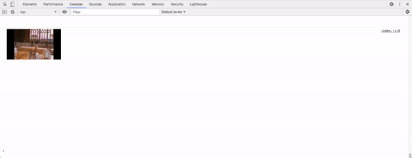

# Dev Tools Theater

Play videos in Chrome Dev Tools console because why not? 



At a high level:
* Pre-processing
    * Frames of a video are extracted into individual images of size 192x108 using ffmpeg, a Python script takes these images, Base64 encodes them and creates a large JSON file with all of the Base64 strings as a list.
* Node server
    * Loads the JSON file in memory, and serves chunks of the file on any given request
* Client side
    * Javascript Worker that constantly looks to buffer 500 chunks at a time while the code on the main thread prints an image every 33 milliseconds (for 24 FPS).
    
# How To Run

Download a video and put it in the `setup/` directory. Run `extract_frames.sh` with your video file's name as the command line argument. For example,

```
./extract_frames.sh video.mkv
```

This will take some time depending on how large your video file is. Next step is to convert the frames into Base64 encoded chunks and store them in a JSON file. This is done with `setup_script.py`. Run this script with Python and it will generate a `images.json` file. 

In one terminal session, run the server. 
```
node server.js
```

In another terminal session, host the client side html file `public/index.html`. I like to use Python's SimpleHTTPServer so that's the example:
```
cd public/
python -m SimpleHTTPServer
```

That's it! Now you can go to `localhost:<whatever port your client side code is hosted on>`, open up Dev Tools Console and you should see your video there! 

There might be some bugs when it comes to different size windows and so on. I haven't gotten around to fixing all of those, but if you have a bug please report it and if you have the time, add a PR to fix it! 